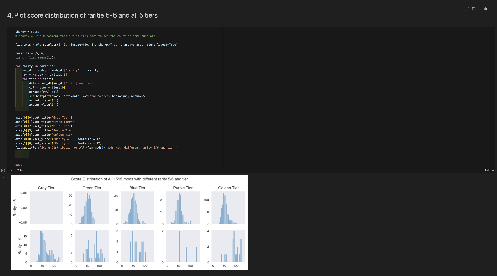

# SWGOH Mods Playground

## Requirements

1. Miniconda or Anaconda
    > Install miniconda if you haven't yet: <https://docs.conda.io/projects/miniconda/en/latest/miniconda-install.html>
1. Visual Studio Code
    > Install VSCode: <https://code.visualstudio.com/download>
1. HotUtil Memebership with access to their mods features
    > <https://hotutils.com>

## Setup

1. Clone the repo
1. Run command line to install project dependencies

    - For macOS and Linux

    ``` bash
    .conda/create-env.sh
    ```

    - For Windows

    ``` cmd
    .conda\create-env.bat
    ```

1. Run command `playwright install` to install a standalone chromium browser for automation
1. Open the repo in VSCode and have fun hacking!

## Pull Mods Data

Run python script from command line

``` bash
python 01_pull_mods_from_hotutils.py
```

> You may need to activate conda environments before running the python script

For the first log in, if you stuck in the endless discord bot check, you can copy ur hotutils session id from the
browser's cookie into `COOKIE_JSON_FILE` (default file is  `data/hotutils_cookie.json`). A minimal sample json data
is like this:

``` json
[
    {
        "name": "hotUtilsSession",
        "value": "the-session-id-for-hotutils",
        "domain": "hotutils.com",
        "path": "/",
        "sameSite": "Lax"
    }
]
```

## Analyze Mods

Open `02_analyze_mods.ipynb` in VSCode, run all the cells.

> You will need to install some VSCode extensions, they should appear in recommendation.


